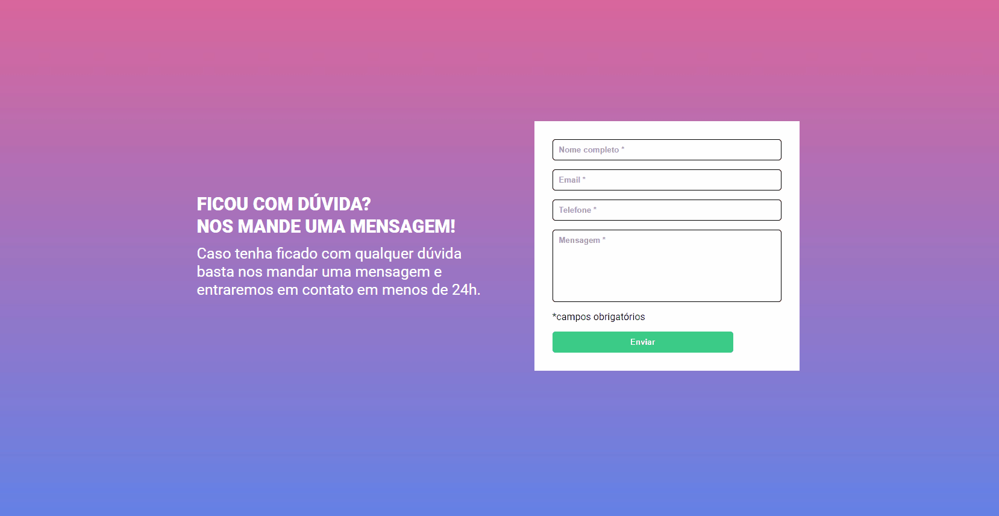

# Desafio Curso DevQuest | Criando um formulário

## Tabela do Conteudo

<ul>
<li><a href="#sobre">Sobre</a></li>
<li><a href="#status">Status</a></li>
<li><a href="#desafio">Desafio</a></li>
<li><a href="#curiosidade">Curiosidade</a></li>
<li><a href="#tecnologias">Tecnologias</a></li>
<li><a href="#acessando-o-site">Acessando o site</a></li>
</ul>

## Sobre

### Layout Desktop | Mobile.

Mais um desafio do curso para treinar nossa lógica e a manipulação do DOM.

## Status

Concluído! 👌

## Desafio

O desafio consiste em:
1- A validação do formulário deve ser feita com javascript puro;
2- Ao clicar para enviar o formulário, se caso algum campo não estiver preenchido, a borda do input deve ficar vermelha e uma mensagem de "campo obrigatório" deve aparecer embaixo do campo que não foi preenchido;
3- Caso o campo esteja preenchido a borda do input deve ficar verde.

## Curiosidade

Consegui resolver esse desafio, porém dessa vez, pude fazer de forma ainda mais limpa e simplificada, mas, sei que ainda precisa de muita melhoria e estou em busca desse conhecimento.

## Tecnologias

<ul>
<li>HTML</li>
<li>CSS</li>
<li>JavaScript</li>
<li>GIT BASH</li>
</ul>

## Acessando o site

Para acessar a página, por favor use esse link : <a href="https://tiago-forward.github.io/desafio-formulario-devquest/" target="_blank">Desafio Curso DevQuest | Criando um formulário</a>